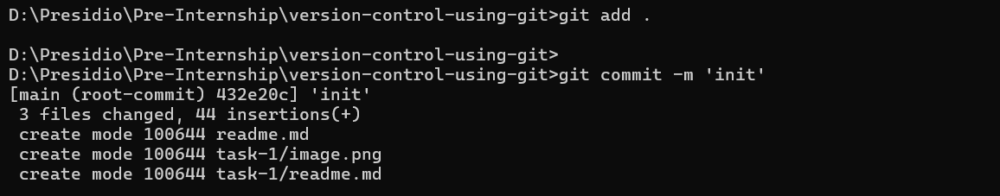

# Task 1

## **Initialize, Commit, and Branch Basics**
    
**Objective:**
    
    - Initialize a new Git repository.
    - Create a few files and commit them.
    - Create a new branch, make changes, and merge it back to the main branch.
    
**Requirements:**
    
    - Use `git init`, `git add`, and `git commit` to start your repository.
    - Create a branch using `git branch` or `git checkout -b` and switch between branches.
    - Merge the branch back to the main branch and verify the commit history.


# Steps Followed:

## 1. Created Directory and Initialized Git

``` git
mkdir version-control-using-git
cd version-control-using-git
git init
```


## 2. Created, Added, Committed the files

Created files and folders using Visual Studio Code.

``` git
git add .
git commit -m 'init'
```



## 3. Created New Branch and Switching to created Branch

``` git
git branch features
git checkout features
git branch
```


## 4. Changes made in features branch and commited to git

``` git
git add .
git commit -m 'features-branch commit'
```


## 5. Difference between Main branch and Features branch

Main Branch


Features Branch


## 6. Merge features branch into main branch
Switching to main branch and merging features branch

``` git
git checkout main
git merge features
```