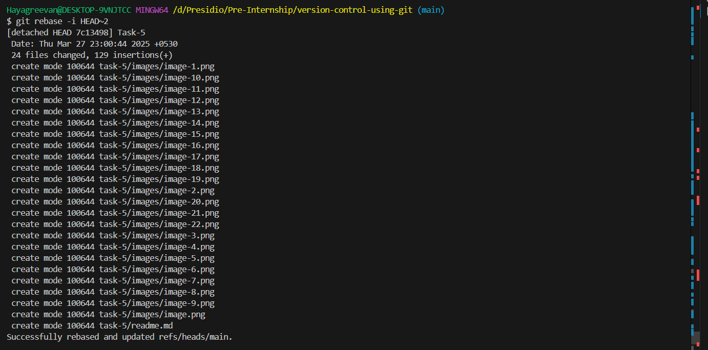
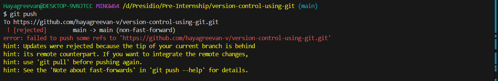
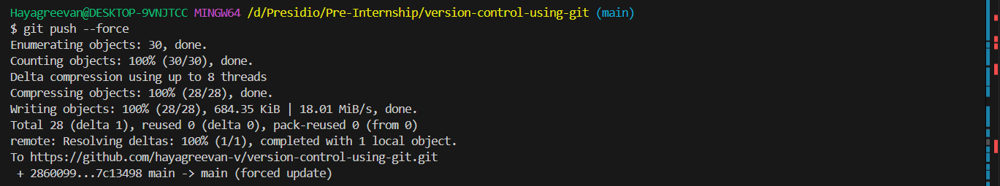
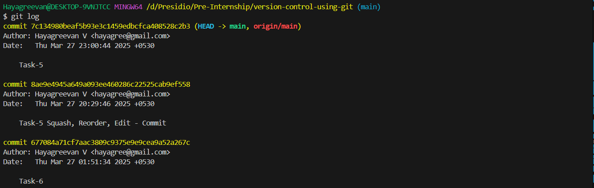
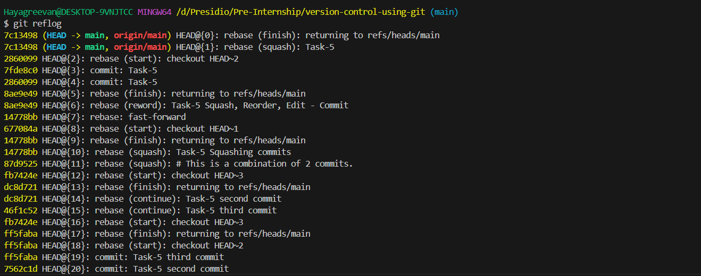
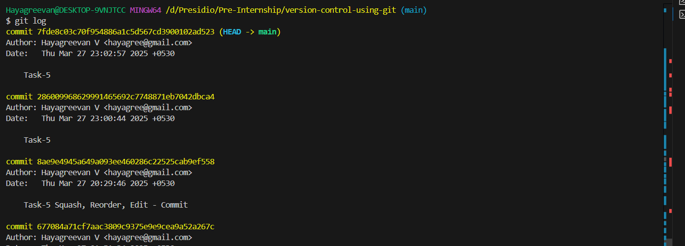

# Task 10

## **Comprehensive Workflow with Forced Pushes and RecoveryObjective:Requirements:**
    - Simulate an advanced Git scenario that includes forced pushes, recovering lost commits, and a multi-branch workflow.
    - Create a repository with multiple branches representing features, bug fixes, and releases.
    - Simulate a scenario where a forced push (`git push --force`) is required (for example, after rewriting history with an interactive rebase).
    - Use `git reflog` to locate and recover lost commits after a mistaken force push.
    - Document each step, explaining how and why forced pushes should be handled with care, and how `git reflog` can be a lifesaver.
    - Discuss best practices for collaborating with teams when rewriting history and using force pushes.

# Steps Followed:

## 1. Creating mutliple branches
``` git
git branch features
git branch bug-fixes
git branch releases
```

## 2. Simulated scenario for forced-push

### Rewriting history with interactive rebase

``` git
git rebase -i HEAD~2
git push
```



### Using `git push --force`

``` git
git push --force
```


## 3.Recover lost commits
```
git log
git reflog
git reset --hard 7fde8c0
```



After successful recovery,



# Discussion

### Explain how and why forced pushes should be handled with care

**Unhandled force pushes can lead to**:

    -  risk of overwriting others' task
    -  disrupts team collaboration
    -  makes debugging default

**How forced pushes can be handled**:

    - Use `git push --force-with-lease`, Instead of `git push --force`
    - Communicate with Your Team
    - Avoid Force Pushes on Shared Branches
    - Use Feature Branches for Rewriting History
    - Use `git reflog`


### How `git reflog` can be a lifesaver
    - `git reflog` keeps a history of all recent changes, even those removed by a forced push. Also used to find previous commit hashes