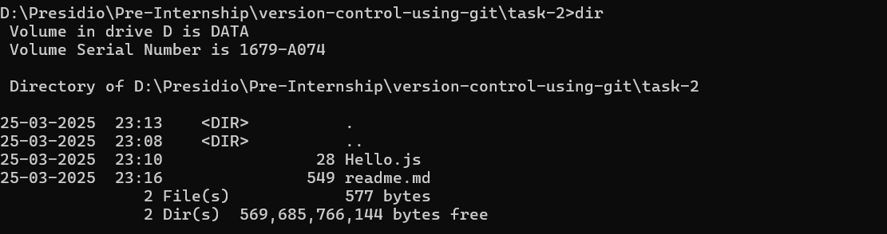
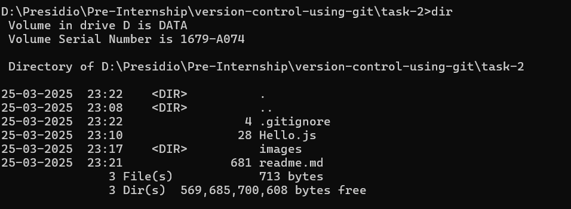
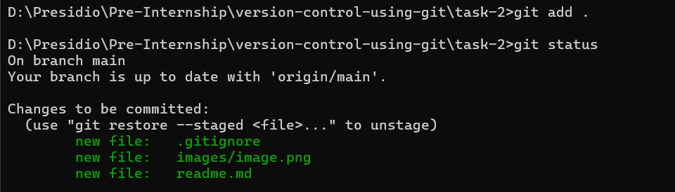
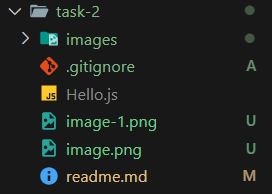

# Task 2

## **Using .gitignore and Tracking Files**
    
**Objective:**
    
    - Set up a `.gitignore` file to exclude certain files or directories.
    - Verify that ignored files are not tracked by Git.
    
**Requirements:**
    
    - Create a `.gitignore` file with patterns (e.g., ignoring log files or temporary files).
    - Add files that match and do not match the ignore patterns.
    - Use `git status` to confirm which files are being tracked.


# Steps Followed:

## 1. Created Two files - Hello.js and readme.md



## 2. Create .gitignore file
Ignore Javascript files

### .gitignore
``` git
    *.js
```

### Files in Directory


### Files added to git

``` git
git add .
git status
```


## 3. Verification

Hello.js file is not tracked by git.


