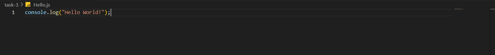
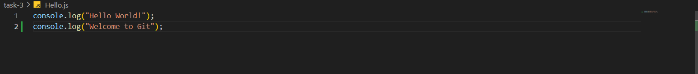
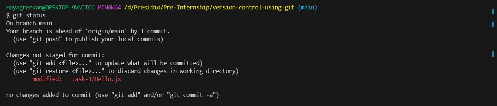
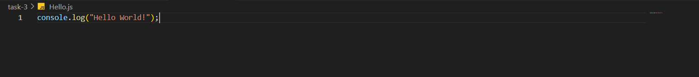
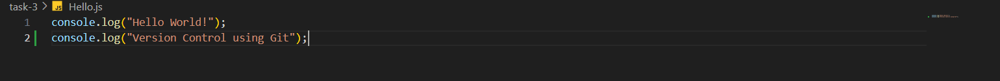
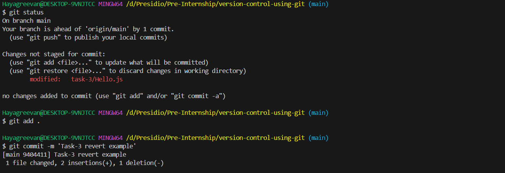
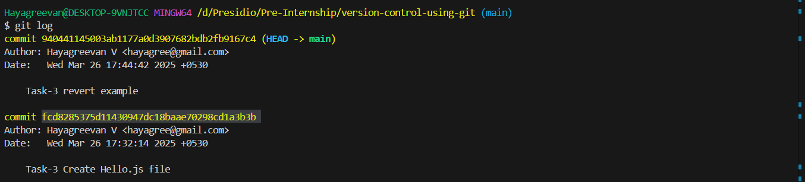
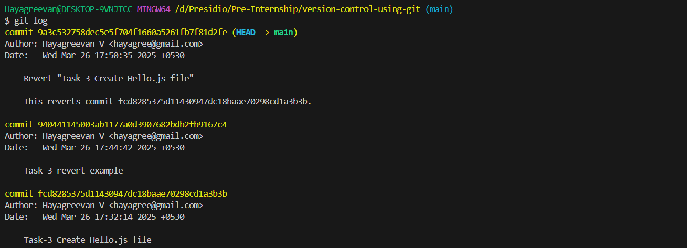

# Task 3

## **Undoing Changes and Reverting Commits**
    
**Objective:**
    
    - Experiment with undoing changes in your working directory and commits.
    
**Requirements:**
    
    - Modify a tracked file and use `git checkout -- <file>` (or `git restore`) to undo changes.
    - Make a commit, then use `git revert` or `git reset` to see how you can undo a commit safely.
    - Explain the differences between these approaches.


# Steps Followed:

## 1. Created Hello.js file and added, committed to git

### Hello.js



## 2. Modifying Hello.js file

### Added another console.log statement


### Modification done in Hello.js
``` git
git status
```


## 3. Undo Change using `git restore`

``` git
git restore ./task-3/Hello.js
```
### After execution of `git restore`



## 4. Making changes and committing to git

### Updated in Hello.js


### Added and Committed to Git
``` git
git status
git add .
git commit -m 'Task-3 revert example
```



## 5. Undo commit using `git revert`

``` git
git log
git revert fcd8285375d11430947dc18baae70298cd1a3b3b  #Commit hash of 'Task-3 Create Hello.js file'
```


## After reverting - `git log` 


## 6. Difference between `git reset` and `git revert`

### `git reset`
    - rollsback to the specified commit
    - removes commits from the commit history [removes all the commits done after the specified commit]
    - all changes done after the specified commit is maintained
    - other contibutors can't able to see the error as it is removed from commit history

### `git revert`
    - creates new commit which resembles specified commit and adds it to the commit history
    - does not remove commits from commit history
    - contributors can see the commit history and changes made to the repository.
    - creates merge conflict with current head commit, user can solve it and perform   `git revert --continue` 
