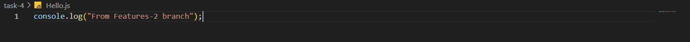

# Task 4
## **Simulating and Resolving Merge Conflicts**
    
**Objective:**
    
    - Create a scenario that produces a merge conflict and resolve it.
    
**Requirements:**
    
    - Create two branches from the same commit.
    - Modify the same line(s) of code in a common file in both branches.
    - Attempt to merge the branches, observe the conflict, and resolve it manually.
    - Use `git status` and `git diff` to identify and resolve the conflicting changes.


# Steps Followed:

## 1. Create Hello.js in main branch

### Hello.js


## 2. Creating Two Branches

``` git
git branch features-1
git branch features-2
```
<!--  -->

## 3. Switching to features-1 branch and Modifying Hello.js file

``` git
git checkout features-1
```

### Updated Hello.js in features-1 branch


### Added and committed to git
``` git
git add .
git commit -m 'Task-4 from features-1 branch'
```

## 4. Switching to features-2 branch and Modifying Hello.js file

``` git
git checkout features-2
```

### Updated Hello.js in features-2 branch


### Added and committed to git
``` git
git addd .
git commit -m 'Task-4 from features-2 branch'
```

## 5. Merging features-2 branch from features-1

### `git diff` befor merge
``` git
git diff features-2     # from features-1 branch
```


### Performing merge features-2 branch from features-1 branch
``` git
git merge features-2
```


Merge conflict has been raised!

### Hello.js during merge conflict


### `git diff` during merge conflict


### `git status` during merge conflict


# 6. Fixing merge conflict

### Updated Hello.js


### Add and Commit the changes to git
``` git
git add .
git commit -m 'Task-4 Merge Conflict resolved'
git status
```


Merge Conflict resolved!