# Task 5

## **Interactive Rebasing for Clean Commit History**
    
**Objective:**
    
    - Use interactive rebase to tidy up your commit history.
    
**Requirements:**
    
    - Create a series of commits (some with minor changes or typos in commit messages).
    - Run `git rebase -i HEAD~n` (with `n` representing the number of commits) to squash, reorder, and edit commit messages.
    - Explain how squashing helps in cleaning up commit history before merging into a main branch.


# Steps Followed:

## 1. Creating series of commit

``` git
git add .
git commit -m 'Task-5 nth commit'
```

### Modifying Hello.js

First Commit
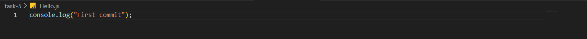

Second Commit
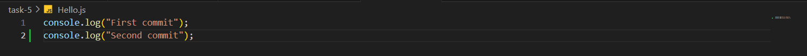

Third Commit
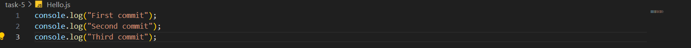

## 2. Seeing commit history

``` git
git log
```
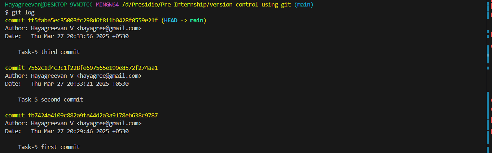

## 3. Reordering commits

Initially,
``` git
git rebase -i HEAD~3
```
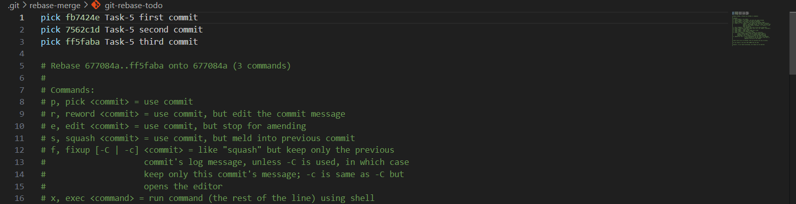

### Moving second commit ahead of third commit

Editing git-rebase-todo and saving it.
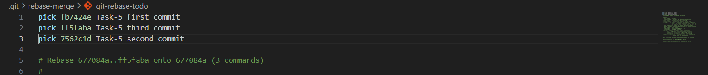

Merge conflict arised.
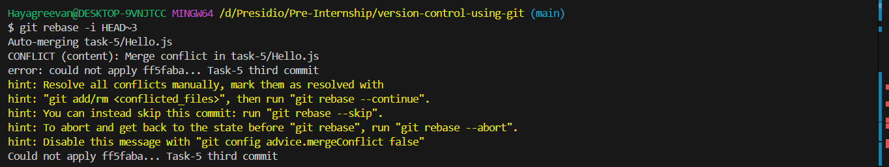

Merge Conflict resolved.
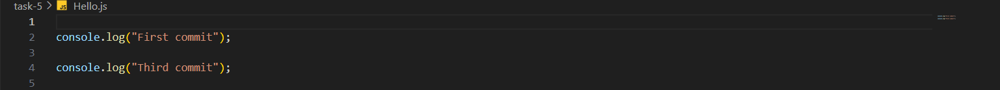

``` git
git add .
git rebase --continue
```
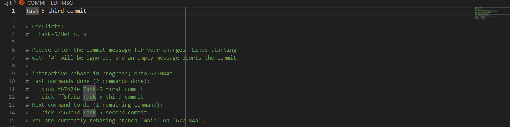

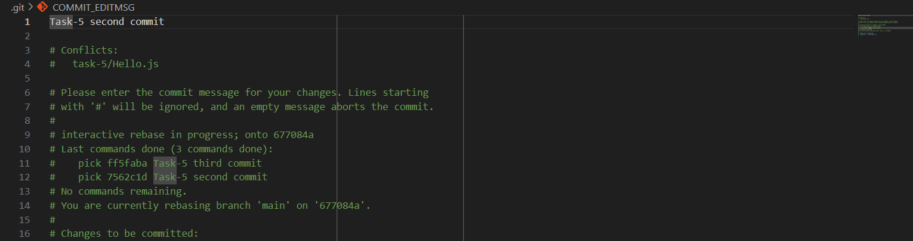

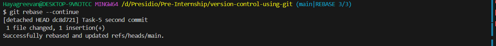

### Updated Commit History
``` git
git log
```


## 4. Squashing commits

``` 
git rebase -i HEAD~3
```
### Editing git-rebase-todo

Initally,
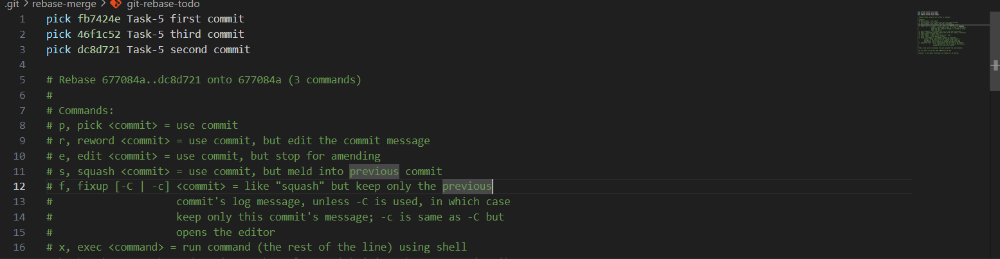

After Modifying,
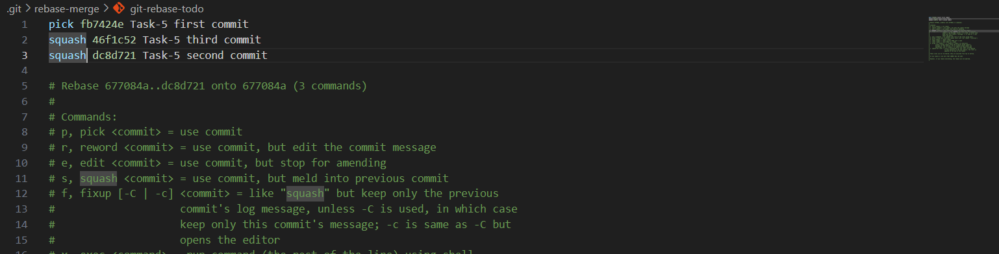

Adding Commit message
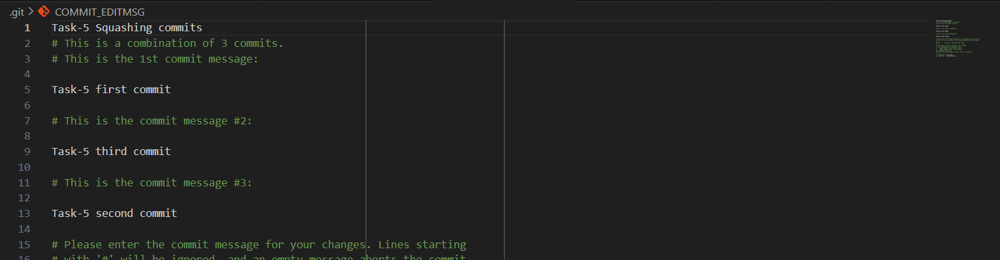

Successfully squashed!
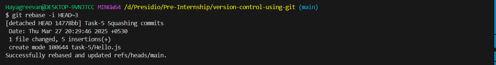

``` git
git log
```
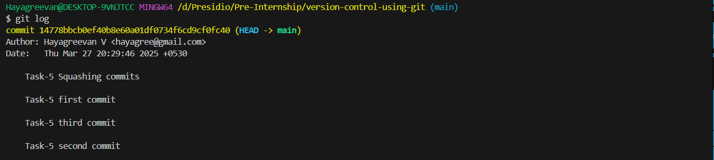

## 5. Editing commit message

``` git
git rebase -i HEAD~1
```

Initially,
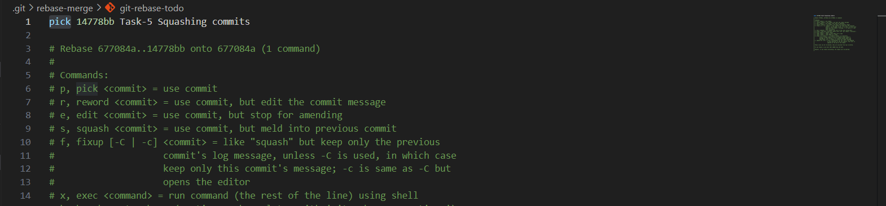

After Editing and saving it,
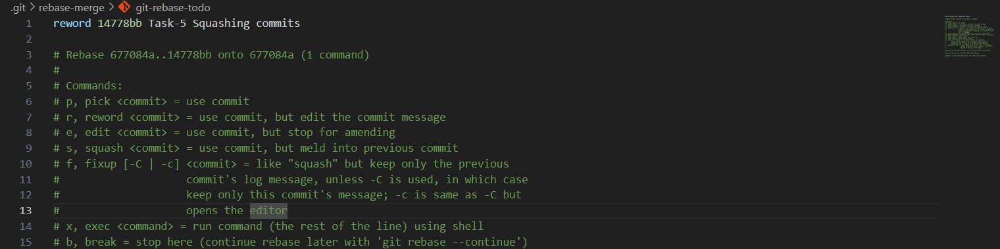

### Editing Commit Message

Initially,
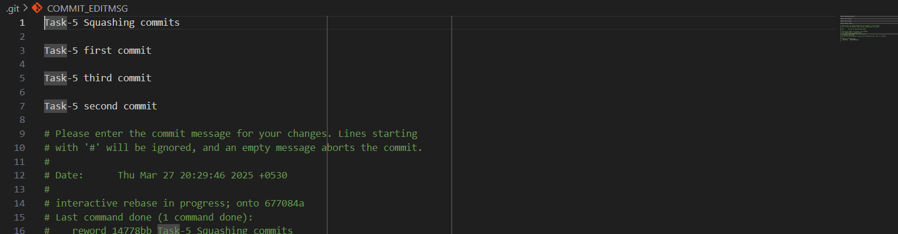

After Editing,
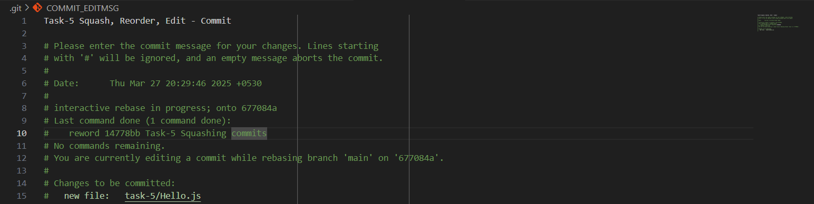

Successfully, Completed Editing Commit Message
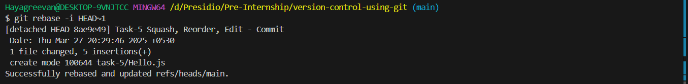


# Squashing Benefits
    - used to merge the multiple commits into single commit
    - used to maintain clean commit history with logical progression
    - Maintained Commit history helps in code review process
