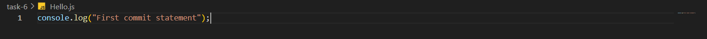
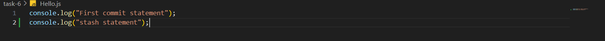
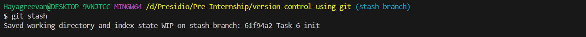
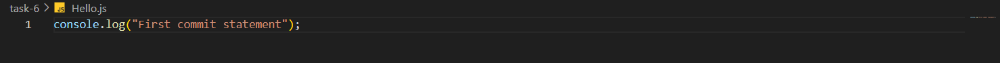
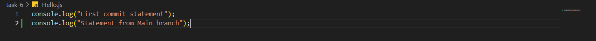
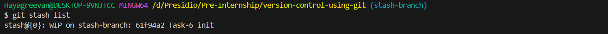
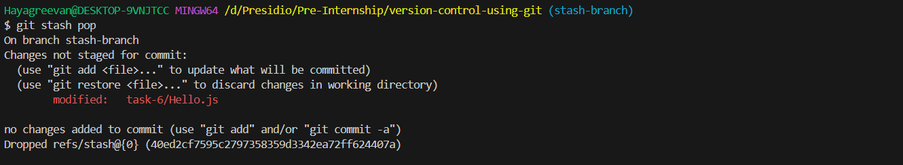
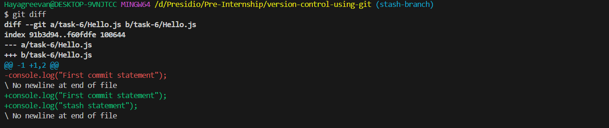
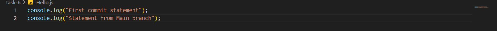
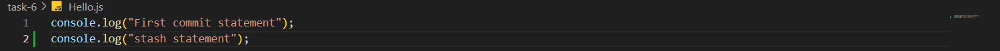

# TAsk 6
## **Stashing Changes for Context Switching**
    
**Objective:**
    
    - Learn how to use Git stash to save uncommitted work temporarily.
    
**Requirements:**
    
    - Make changes in your working directory without committing.
    - Use `git stash` to save these changes.
    - Switch branches, perform some work, then return and reapply your stashed changes with `git stash pop`.
    - Optionally, demonstrate how to view and manage multiple stashes using `git stash list` and `git stash drop`.

# Steps Followed:

## 1. Created Hello.js file

### Hello.js


### Add and Commit to Git
``` git
git add .
git commit -m 'Task-6 init'
```

## 2. Create new branch and make some changes and stash it

``` git 
git checkout -b stash-branch
```

### Modify Hello.js file


### Without commit, stash the changes
``` git
git stash
```


### After stash, Hello.js file



## 3. Switch to Main branch and modify Hello.js

``` git
git checkout main
```

### Modified Hello.js file


### Add and commit to git

``` git
git add .
git commit -m 'Task-6 initial commit'
```

## 4. Switch to stash branch and reapply stashed changes

``` git 
git checkout stash-branch
```
### Stash history
``` git
git stash list
```


### Reapply stashed changes using `git stash pop` in stash-branch
``` git
git stash pop
git diff
```



### Add and Commit to Git
``` git
git add .
git commit -m 'Task-6 Stashed commit'
```

### Now, Two different branched have two different statements in Hello.js

#### main branch



#### stash branch



With the help of stashing, changes made in one branch is maintained without commit and can be reapplied after making changes to another branch.