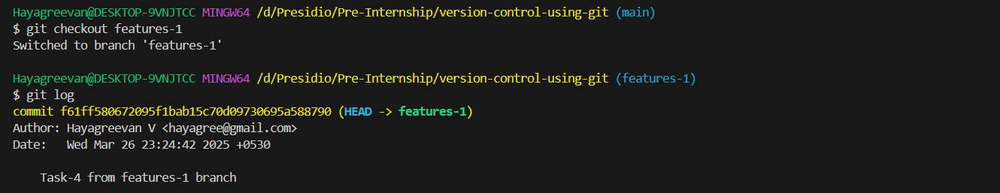

# Task 7

## **Cherry-Picking Commits Between Branches**
    
**Objective:**
    
    - Selectively apply a commit from one branch to another using cherry-pick.
    
**Requirements:**
    
    - Create two branches with distinct commits.
    - Identify a commit on one branch that you want to apply to the other.
    - Use `git cherry-pick <commit-hash>` to apply the commit and handle any conflicts if they arise.
    - Verify the commit history to ensure the cherry-picked commit is present.

# Steps Followed:

## 1. Comparing two branches - main & features-1

### main branch


``` git
git checkout main
git log
```


### features-1 branch


``` git
git checkout features-1
git log
```


Here, features-1 branch contains directory and files of **task-4** which needs to be moved to main branch.

## 2. Identifying the commit that needs to be applied to main branch

```
commit f61ff580672095f1bab15c70d09730695a588790 (HEAD -> features-1)
Author: Hayagreevan V <hayagree@gmail.com>
Date:   Wed Mar 26 23:24:42 2025 +0530

    Task-4 from features-1 branch
```

## 3. Using `git cherry-pick <commit-hash>` to apply the commit to the main branch and verifying the commit history

``` git
git checkout main
git cherry-pick f61ff580672095f1bab15c70d09730695a588790
git log
```


Commit history is updated without any Merge Conflict!