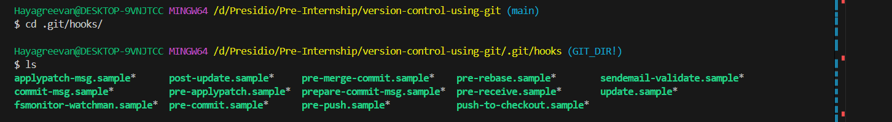
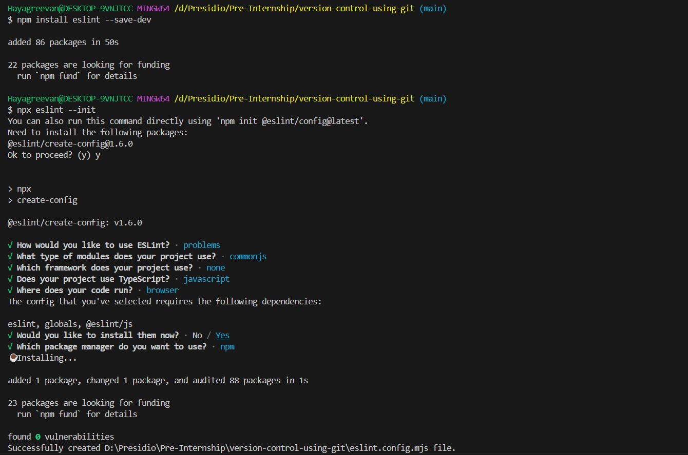
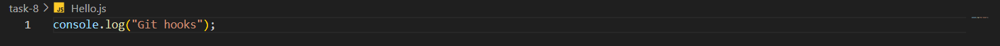
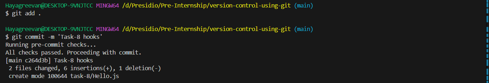
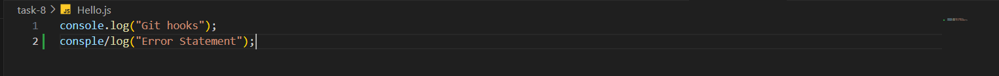
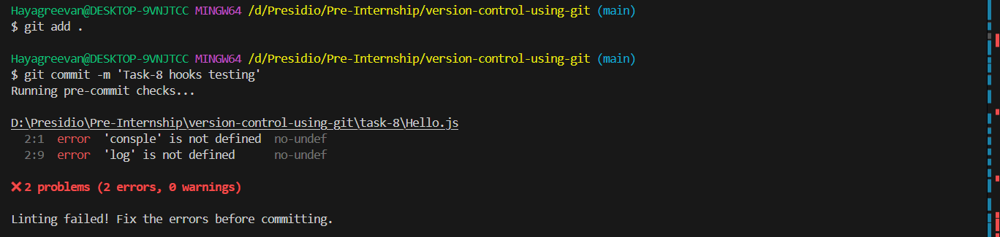
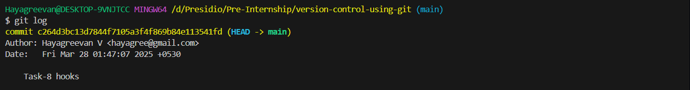

# Task 8

## **Using Git Hooks for Automated Checks**
    
**Objective:**
    
    - Set up a Git hook to run scripts (like linters or tests) before commits are finalized.
    
**Requirements:**
    
    - Create a `pre-commit` hook in the `.git/hooks` directory.
    - Write a simple script (e.g., a shell script or Node script) that runs a linter or a unit test.
    - Ensure that if the tests or linting fail, the commit is aborted.
    - Document how Git hooks can improve code quality in collaborative projects.

# Steps Followed:

## 1. Creating *pre-commit* git hook

### Visiting git hooks directory and creating pre-commit git hook

``` sh
cd ./.git/hooks
ls
touch pre-commit
code pre-commit
```


## 2. Setting up eslint for error checking

``` node
npm install eslint --save-dev
npx eslint --init
```



## 3. Adding pre-commit script

``` bash
#!/bin/bash
echo "Running pre-commit checks..."

# Run ESLint
if ! npx eslint .; then
  echo "Linting failed! Fix the errors before committing."
  exit 1
fi

echo "All checks passed. Proceeding with commit."

```

## 4. Testing hook

### Hello.js file

#### Without Syntax Error


``` git 
git add .
git commit -m 'Task-8 hooks'
```


#### With Syntax Error


``` git
git add .
git commit -m 'Task-8 hooks testing'
```



### Checking Commit history

``` git
git log
```



`Task-8 hooks` commit is added. But `Task-8 hooks testing` commit is not added due to error.

#Discussion

## How Git hooks can improve code quality in collaborative projects.

    - Testing can be automated with git hooks.
    - With the help of linters like eslint, Syntax errors can identified and fixed
    - Used for Auto-formating
    - Reduces the chances of bug
    - Maintains the Coding standards mentioned by the developers