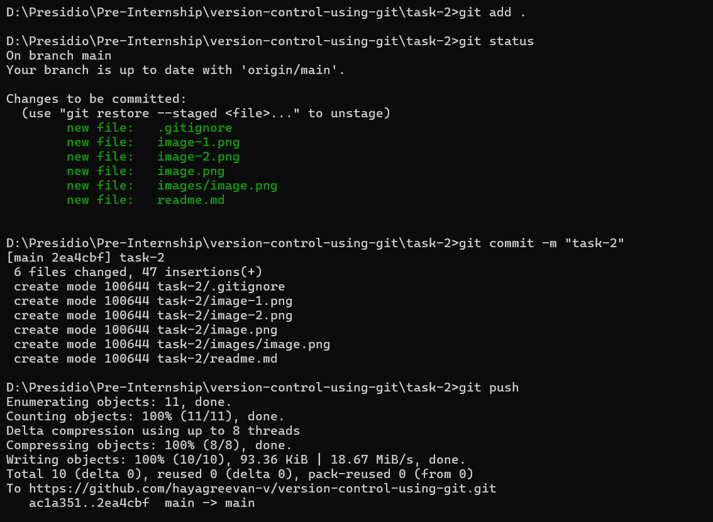
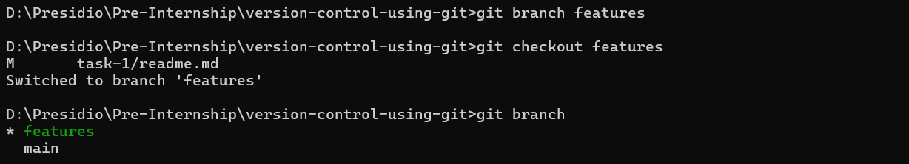
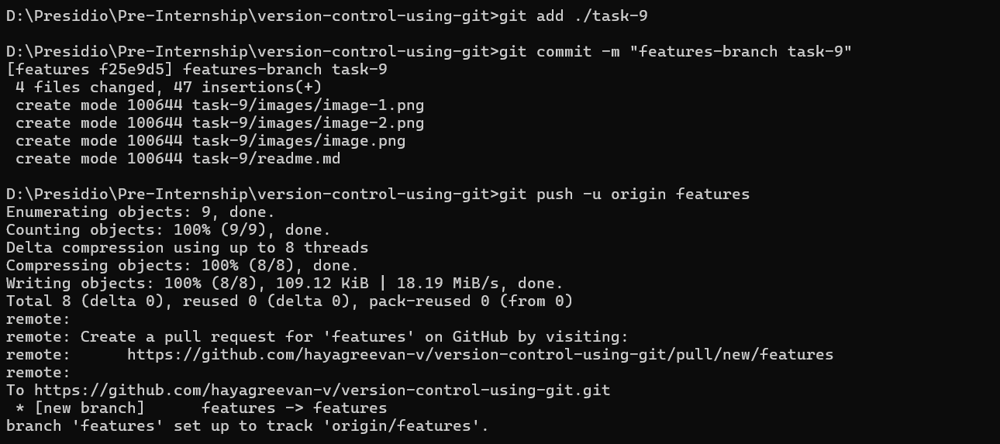
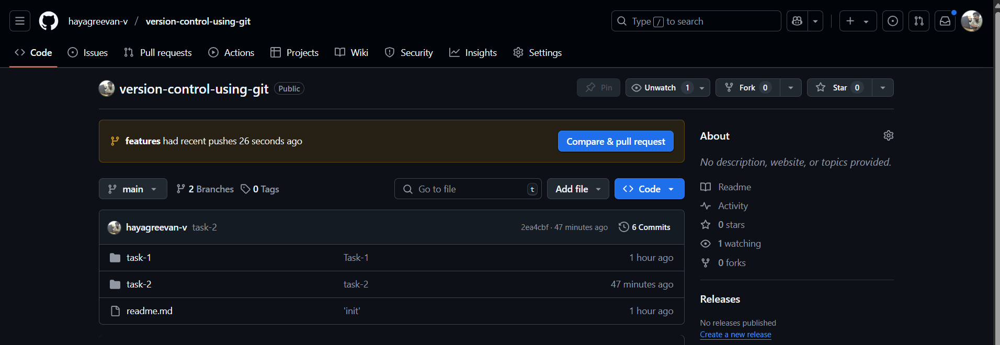
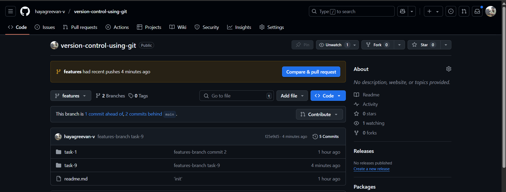
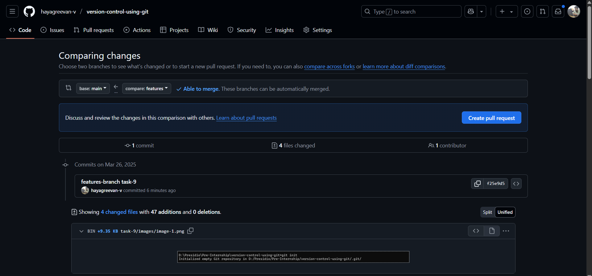

# Task 9

## **Working with Remote Repositories and Collaboration**
    
**Objective:**
    
    - Simulate a collaborative workflow with remote repositories.
    
**Requirements:**
    
    - Create a local repository and push it to a remote service (e.g., GitHub or GitLab).
    - Create a feature branch, make commits, and push the branch to the remote.
    - Open a Pull Request (or Merge Request) and perform a code review process.
    - Merge the feature branch into the main branch on the remote and then pull the changes locally.

# Steps Followed:

## 1. Created Local Repository and pushed it to remote service - Github

``` git
git init
git add .
git status
git commit -m 'task'
git remote add origin https://github.com/hayagreevan-v/version-control-using-git.git
git push -u origin main
```



## 2. Created and Switched to features branch

``` git
git branch features
git checkout features
git branch 
```



## 3. Creating commits and pushing the features branch to remote

``` git
git add .
git commit -m 'features-branch task-9'
git push -u origin features
```


## 4. Opening Pull Request to merge branches in Github

### Main branch (Before Merge)


### Features branch (Before Merge)


### Creating Pull Request




## 5. Merging Pull Request in remote (Github)


## 6. Merged feature branch into main branch on the remote (Github)

### Main branch after merge


